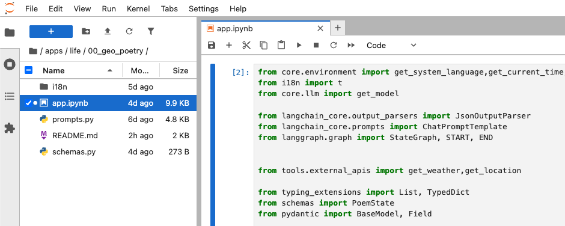
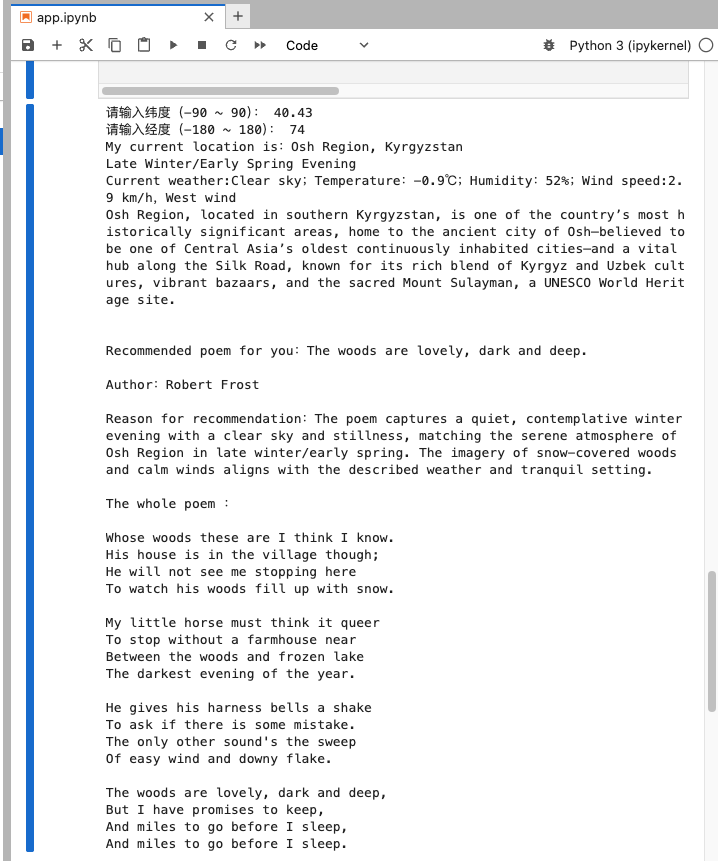
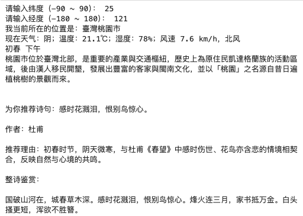

# 100 Local AI Use Cases for Everyday Life

<div align="left">
100 Local AI Use Cases for Everyday Life is an open-source project exploring practical, privacy-friendly AI applications running locally. 


一个探索实用、隐私友好型本地 AI 应用的开源项目，重点关注个人生产力、学习、创意和自动化等实际场景。

[](https://opensource.org/licenses/MIT)
[](https://www.python.org/downloads/)
[]()

**🎯 Every AI use case is worth running locally**
**🎯 每一个 AI 应用场景，都值得本地运行**

[English](#english) | [中文说明](#chinese)

</div>

## 📖 Introduction<a id="english"></a>

**100 Local AI Use Cases for Everyday Life** is an open-source project exploring practical, privacy-friendly AI applications running locally. Each use case is modular, reproducible, and focused on real-world value — from personal productivity to learning, creativity, and automation. Build, experiment, and own your AI stack.


## ✨ Features

- 🏠 **Local Execution**: Run all AI applications locally on your machine. Your data stays on your device — no cloud APIs, no privacy concerns.
- 🔧 **Modular Design**: Each use case is self-contained, easy to understand, and ready to customize.
- 🎯 **Practical Focus**: Focus on real-world applications that solve actual problems in daily life and work.
- 🌍 **Multi-language Support**: Currently supports Chinese and English, with more languages planned.
- 🚀 **Easy Deployment**: Simple installation and execution process for each use case.


## 🎯 Current Use Cases

**00. Poetry from Coordinates(坐标之诗)** [Explore](apps/life/00_geo_poetry/README.md) 
Before AI helps us improve work efficiency,it can help us feel the world again.

> More applications are under development...


## 📁 Project Structure

```
100-Local-AI-Use-Cases-for-Everyday-Life/
├── apps/                    # Application examples
│   ├── learning/           # Learning AI applications
│   └── life/               # Life AI applications
│       └── 00_geo_poetry/  # Geo Poetry Generator
├── core/                    # Core modules
│   ├── llm.py              # LLM base interface
│   └── environment.py      # Environment configuration
├── tools/                   # Utility functions
│   └── external_apis.py    # External API calls
├── LICENSE                  # MIT License
└── README.md                # Project documentation
```

## 🚀 Quick Start

### 1. Clone the Repository

Open your terminal and run the following commands:

```bash
git clone https://github.com/yourname/100-Local-AI-Use-Cases-for-Everyday-Life.git
cd 100-Local-AI-Use-Cases-for-Everyday-Life
```

### 2. Set Up Environment

Choose **one** of the following methods to prepare your environment:

**Option A: Using venv **

```bash
# Create a virtual environment
python -m venv .venv

# Activate on Mac/Linux:
source .venv/bin/activate

# Activate on Windows:
.venv\Scripts\activate
```

**Option B: Using Conda (Recommended)**

```bas
conda create --name local-ai python=3.10 -y
conda activate local-ai
```

### 3. Install Dependencies

Ensure your environment is active, then run:

```bash
pip install --upgrade pip
pip install -e .
```

### 4. Run the Project

Launch Jupyter Lab to start exploring the use cases:

```bash
jupyter lab
```

### 📖 How to Use

After launching Jupyter Lab, navigate to the `apps/` directory in the sidebar.

1. **Open a Notebook:** Runnable files are typically named `app.ipynb`.
2. **Execute:** Click the **Run** button in the toolbar (as shown below) to see the results.



#### Example: "Poetry from Coordinates"

Using the first application of this project as an example: after running the notebook and entering coordinates, you will receive an output like this:




### 📝 License

This project is licensed under the [MIT License](LICENSE). See [LICENSE](LICENSE) for details.


### 🙏 Acknowledgments

Special thanks to all developers who contributed to this project!


### 📧 Contact

If you have any questions or suggestions, please feel free to contact me via GitHub Issues or email.


<div align="center">

**⭐ If this project helps you, please give me a star! ⭐**

Made with ❤️ by BigBenLabs

</div>


## 📖 简介<a id="chinese"></a>

100 Local AI Use Cases for Everyday Life 是一个开源项目，探索在本地运行的实用、隐私友好的 AI 应用场景。每个用例都是模块化、可重现的，专注于实际价值——从个人生产力到学习、创意和自动化。构建、实验，并掌控你的 AI 栈。


## ✨ 核心特性

- 🏠 **本地运行**: 数据在本地处理，确保隐私和安全
- 🔧 **模块化设计**: 每个 AI 用例独立、可扩展
- 🎯 **实用主义**: 聚焦实际生活和工作中的真实需求
- 🌍 **多语言支持**: 中文、英文等多种语言支持
- 🚀 **快速部署**: 简化的安装和运行流程


## 🎯 现有用例

**00.坐标之诗（Poetry from Coordinates）** [Explore](apps/life/00_geo_poetry/README.md) 
在 AI 帮助我们提升工作效率之前，它也可以帮助我们重新感受世界。

> 更多应用正在开发中...


## 📁 项目结构

```
100-Local-AI-Use-Cases-for-Everyday-Life/
├── apps/                    # 应用示例
│   ├── learning/           # 学习类 AI 应用
│   └── life/               # 生活类 AI 应用
│       └── 00_geo_poetry/  # 地理诗歌生成器
├── core/                    # 核心模块
│   ├── llm.py              # LLM 基础接口
│   └── environment.py      # 环境配置
├── tools/                   # 工具函数
│   └── external_apis.py    # 外部 API 调用
├── LICENSE                  # MIT 许可证
└── README.md                # 项目说明
```

## 🚀 快速开始

### Step 1. 克隆项目

打开终端，运行以下命令：

```bash
git clone https://github.com/yourname/100-Local-AI-Use-Cases-for-Everyday-Life.git
cd 100-Local-AI-Use-Cases-for-Everyday-Life
```

### Step 2. 创建虚拟环境

请从以下两种方式中选择 **一种** 来准备你的运行环境：

**方式 A：使用 venv**

```bash
# 创建虚拟环境
python -m venv .venv

# Mac/Linux 激活方式：
source .venv/bin/activate

# Windows 激活方式：
.venv\Scripts\activate
```

**方式 B：使用 Conda（推荐）**
```bash
conda create --name local-ai python=3.10 -y
conda activate local-ai
```


### Step 3. 安装依赖

确保虚拟环境已激活，然后运行：

```bash
pip install --upgrade pip
pip install -e .
```


### Step 4. 运行项目

启动 Jupyter Lab，开始探索这些本地 AI 应用案例：

```bash
jupyter lab
```

### 📖 使用说明

启动 Jupyter Lab 后，在左侧文件栏中进入 apps/ 目录。

使用步骤：
	1.	打开 Notebook： 可运行文件通常命名为 app.ipynb
	2.	执行代码： 点击工具栏中的 Run（运行） 按钮（如下图所示）即可查看运行结果


#### 示例：Poetry from Coordinates（坐标之诗）

以本项目的第一个应用为例：

运行 Notebook 并输入一组经纬度坐标后，你将得到类似如下的输出结果：




## 📝 许可证

本项目采用 [MIT 许可证](LICENSE)。详见 [LICENSE 文件](LICENSE)。

## 🙏 致谢

感谢所有为本项目做出贡献的开发者！

## 📧 联系方式

如有问题或建议，欢迎通过 GitHub Issues 或 E-mail 联系我。

<div align="center">


**⭐ 如果这个项目对你有帮助，请给我一个星标！⭐**

Made with ❤️ by BigBenLabs

</div>